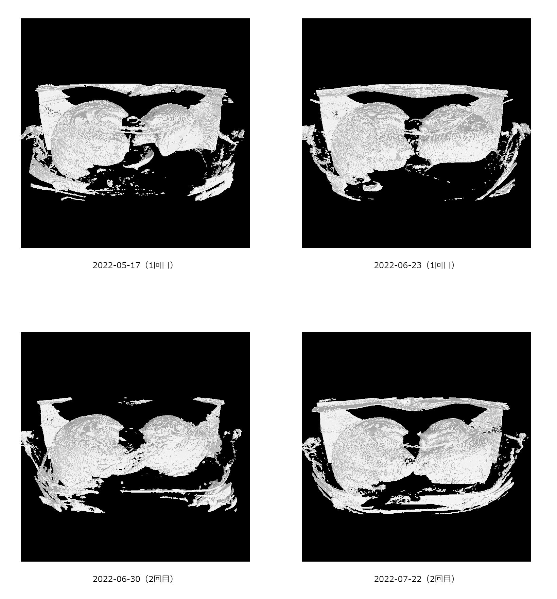

# vlung

肺気胸の際に撮影された自分自身のCT画像データを表示するためのソフトウェアです。

使用しているデータは[vlung-analysis](https://github.com/puripuri2100/vlung-analysis)というソフトウェアを使うことで自動で生成しています。そのため、このvlung-analysisを使いこのソフトウェアの該当するパスを書き替えることでCT画像データを同様に表示することができるようになります。

<div style="text-align: center">
  
</div>

## 公開

<https://puripuri2100.site/vlung/>で動作しているところを確認できます。

## 起動方法

必要なソフトウェア

- git
- npm


まずnpmでhttp-serverをインストールします。

次にこのリポジトリをcloneします。
ただし、objファイルのファイル容量が大きすぎるためデフォルトではhash値が書かれたファイルしか生成されません。そこで、次のリンクのGoogleドライブからファイルをダウンロードして置き換えてください：<https://drive.google.com/drive/folders/10rkCqwq9MZsZZQNpuKy0DyPRtPv5fOV6>

最後にhttp-serverをこのリポジトリのフォルダで起動します。その後、メッセージに従って該当するURLにブラウザでアクセスしてください。


```sh
sudo npm install -g http-server
git clone https://github.com/puripuri2100/vlung.git
cd vlung
http-server --cors
```

## ライセンス

全てのデータはCC0ライセンスのもと配布されます。
